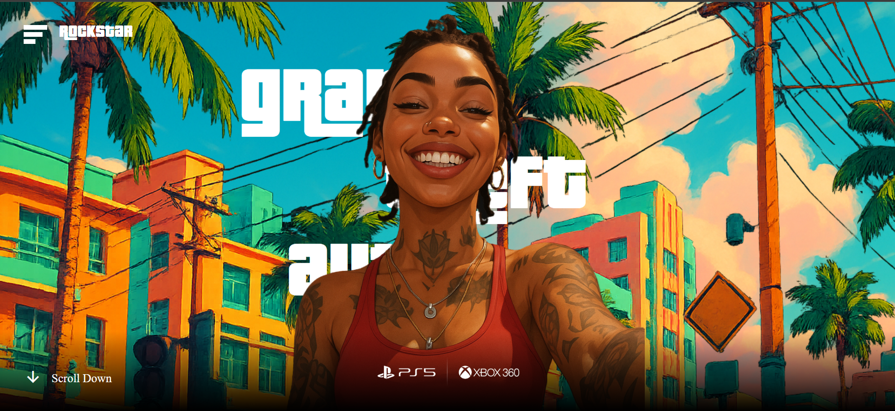
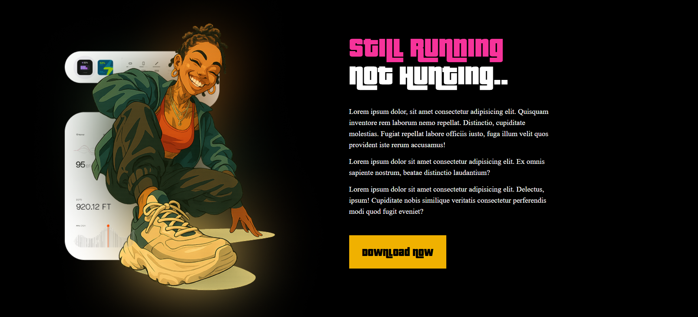
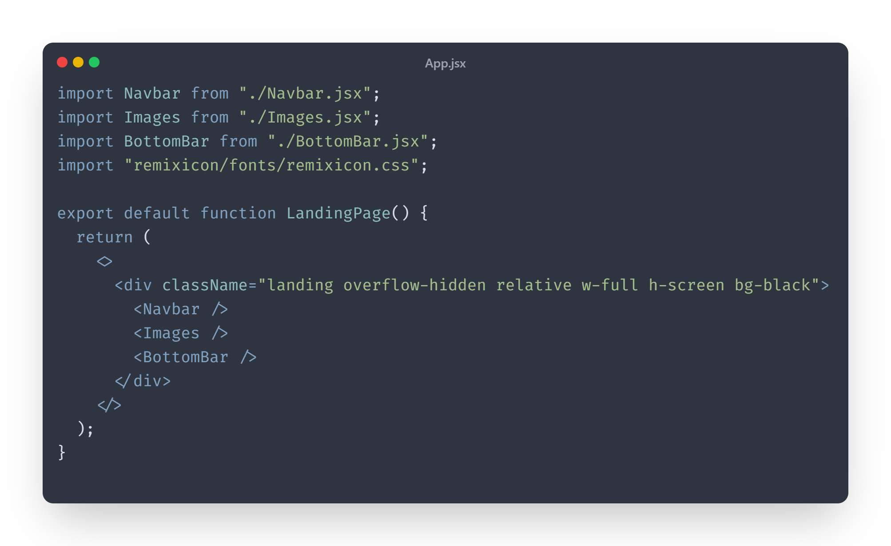

# GTA 6 Landing Page


Hello Developers..<br>
This side aditya.!  
Welcome to the **GTA 6 Landing Page**, a modern and interactive web experience built with **React**, **GSAP**, and **Tailwind CSS**. This project simulates a high-quality, animated landing page for the much-anticipated release of **Grand Theft Auto VI**.

---

## 🚀 Live Demo

> 🔗 _Coming Soon..._  
> *( On [Vercel](https://vercel.com/) or [Netlify](https://netlify.com/))*

---

## 📸 Screenshots

**Landing Page**
  
**Next Page**
 


---

## 🛠️ Tech Stack

- **React.js** – Frontend framework
- **GSAP (GreenSock)** – Powerful animation library
- **Tailwind CSS** – Utility-first CSS framework
- **JavaScript** – Core scripting language

---

## ✨ Features

- ⚡ Smooth GSAP-based animations on scroll and load
- 📱 Fully responsive design using Tailwind CSS
- 🧩 Clean and modular React components
- 📄 Simple and informative layout for GTA 6 teaser

---

## 📂 Folder Structure
```
reactGTA/
├── public/
├── src/
│ ├── App.jsx
│ ├── BottomBar.jsx
│ ├── Button.jsx
│ ├── Images.jsx
│ ├── index.css
│ ├── LandingPage.jsx
│ ├── LastPage.jsx
│ ├── LeftSide.jsx
│ ├── main.jsx
│ ├── Navbar.jsx
│ ├── RightSide.jsx
│ ├── Svg.jsx
├── .gitignore
├── index.html
├── package.json
├── package-lock.json
├── vite.config.js
├── README.md
```


---

## ⚙️ Installation

```bash
# Clone the repo
git clone https://github.com/your-username/gta6-landing-page.git

# Navigate into the folder
cd gta6-landing-page

# Install dependencies
npm install

# Start development server
npm run dev

```

## 📌 Example Code Snippet
 


## 👨‍💻 Author
Aditya Binjagermath <br>
📧 adityabinjagermath12@gmail.com <br>
🔗 GitHub


## 📃 License
This project is licensed under the MIT License.
